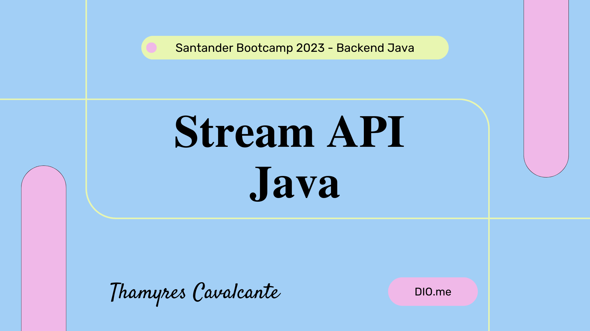

| Curso | BOOTCAMP SANTANDER 2023 - DIO  |
| -------------  |--------------------------------|
| Nome        | **Ganhando_produtividade_com_Stream_API_Java**  
| Tecnologias | Java, Collections, Intellij, Stream                 
| URL         | https://github.com/Thamyresmya/Santander_Bootcamp_Back-End-Java-Stream_API

# Curso: Ganhando_produtividade_com_Stream_API_Java

 

  <a href="#-tecnologias">Tecnologias</a>&nbsp;&nbsp;&nbsp;|&nbsp;&nbsp;&nbsp;  
  <a href="#-conteudo">Conteúdo</a>&nbsp;&nbsp;&nbsp;|&nbsp;&nbsp;&nbsp;  
  <a href="#-tecnica">Técnicas</a>&nbsp;&nbsp;&nbsp;&nbsp;&nbsp;&nbsp;

 

## 🚀 Tecnologias

Esse projeto foi desenvolvido com as seguintes tecnologias:

- Java
- Stream
- Collections
- Intellij
- Git e Github

## 💻 Conteúdo

* `Consumer<T>`: Representa uma operação que aceita um argumento do tipo T e não retorna nenhum resultado. É utilizada principalmente para realizar ações ou efeitos colaterais nos elementos do Stream sem modificar ou retornar um valor.

* `Supplier<T>`: Representa uma operação que não aceita nenhum argumento e retorna um resultado do tipo T. É comumente usada para criar ou fornecer novos objetos de um determinado tipo.

* `Function<T, R>`: Representa uma função que aceita um argumento do tipo T e retorna um resultado do tipo R. É utilizada para transformar ou mapear os elementos do Stream em outros valores ou tipos.

* `Predicate<T>`: Representa uma função que aceita um argumento do tipo T e retorna um valor booleano (verdadeiro ou falso). É comumente usada para filtrar os elementos do Stream com base em alguma condição.

* `BinaryOperator<T>`: Representa uma operação que combina dois argumentos do tipo T e retorna um resultado do mesmo tipo T. É usada para realizar operações de redução em pares de elementos, como somar números ou combinar objetos.

## 📁 Acesso ao projeto

É possível acessar o código através deste [Link](https://github.com/Thamyresmya/Santander_Bootcamp_Back-End-Java-Stream_API).

Neste repositório você tem acesso a todo o material desenvolvido.

 

## ✔️ Técnicas e tecnologias utilizadas

- `JAVA`:  A linguagem de programação Java é objetivada principalmente na orientação a objeto, independência de plataforma, recursos de rede, carga dinâmica de código e segurança, além disso, é uma linguagem copilada.

- `Collection Framework`: Qualquer grupo de objetos individuais representados como uma única unidade é conhecido como coleção de objetos. Em Java, uma estrutura separada chamada “Collection Framework” foi definida no JDK 1.2, que contém todas as classes de coleção e interface nela. Em Java, a interface Collection ( java.util.Collection ) e a interface Map ( java.util.Map ) são as duas principais interfaces “raiz” das classes de coleção Java.

- `Stream API`: A Streams API traz uma nova opção para a manipulação de coleções em Java seguindo os princípios da programação funcional.

- `Stream`, trata-se de uma poderosa solução para processar coleções de maneira declarativa, ao invés da tradicional e burocrática forma imperativa.

 

## 🔗 Me siga nas redes sociais:
- [Linkedin](https://www.linkedin.com/in/thamyrescavalcante/)
- [Instagran](https://www.instagram.com/thamyres__cavalcante/)

 

---

### Feito com 💜 by Thamyres Cavalcante.